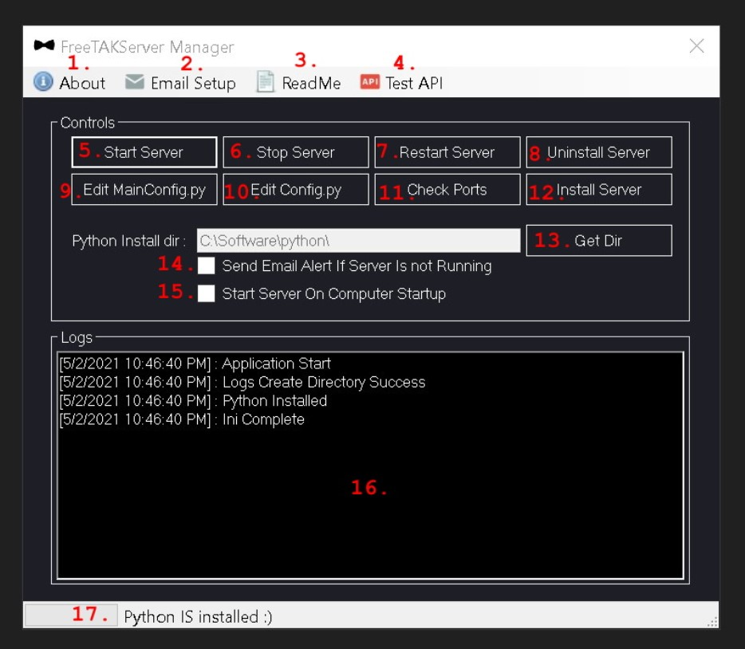
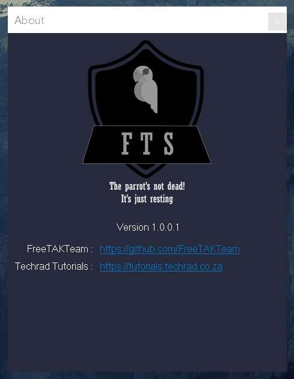
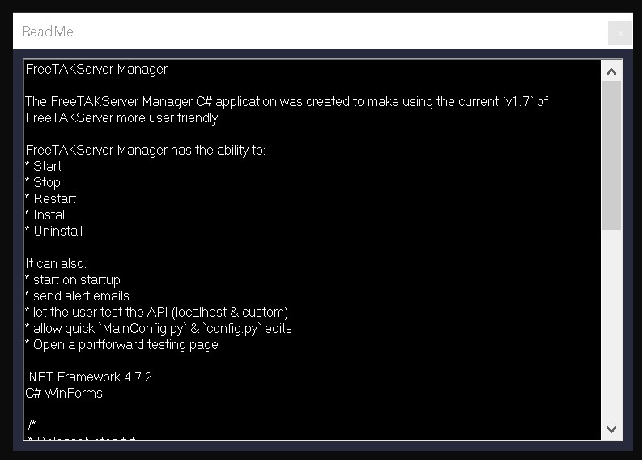
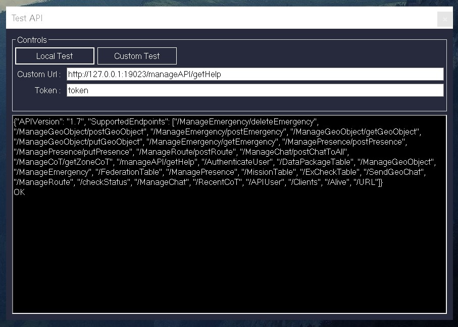

# FreeTAKServer Manager For Windows Computers

Just a quick C# working example of a FreeTAKServer Manager application for the Windows OS.

WinForms & WPF versions are supported.

---

The FreeTAKServer Manager C# application was created to make using the current `v1.7` of FreeTAKServer more user friendly.

FreeTAKServer Manager has the ability to Start, Stop, Restart, Install and Uninstall the FreeTAKServer & FreeTAKServer-UI.

It can also start on startup, send alert emails, let the user test the API (localhost & custom), allow quick `MainConfig.py` & `config.py` edits, Open a portforward testing page.

The App requires Admin privilege in order to run cmd commands effectively.

Remove all previous Python environment variables (if you have them) because they mess up the paths.

N.B the application has been created with the microsoft Visual Studio 2019 Community IDE. (https://visualstudio.microsoft.com/vs/)

[](img/heading.jpg)

# WinForms Section

## App File Structure

```
FreeTAKServer_Manager root folder
│   FreeTAKServer_Manager.exe
│   config.py
│   MainConfig.py
│   ReadMe.txt
│   requirements.txt
│
└───Logs
    │   FreeTAKServer_Manager_2021-12-4--17-21-01.log
```

## App Behaviour


The app is built on the `.NET Framework 4.7.2` & is a WinForms C# application.

The `app.manifest` allows the app to be dpiAware.

supported OS's

```XML
<!-- Windows Vista -->
<supportedOS Id="{e2011457-1546-43c5-a5fe-008deee3d3f0}"/>
<!-- Windows 7 -->
<supportedOS Id="{35138b9a-5d96-4fbd-8e2d-a2440225f93a}"/>
<!-- Windows 8 -->
<supportedOS Id="{4a2f28e3-53b9-4441-ba9c-d69d4a4a6e38}"/>
<!-- Windows 8.1 -->
<supportedOS Id="{1f676c76-80e1-4239-95bb-83d0f6d0da78}"/>
<!-- Windows 10 --> 
<supportedOS Id="{8e0f7a12-bfb3-4fe8-b9a5-48fd50a15a9a}"/>
```
Windows native classes
- The app makes use of the windows `Registry` to check for the python path and to allow start on startup.

- The app will use the `Process` class to send commands to the commandline.

- The app will use the `MailMessage` class to send emails to the details specified.

- The `File` class will be used for read/write functions.

- The `HttpClient` class will be used for testing the API.

Custom classes
- `CMD_Class.cs` handles all the calls to `cmd.exe`.

- `CMD_PID_Class.cs` gets or sets the Server and ServerUI PID in public variables.

- `EmailVarClass.cs` gets or sets the public Email variables.

- `LoggerClass.cs` logs events such as errors or results to a file.

- `EncryptionClass.cs` to encrypt the password for the email function.

## Diagrams

### MainForm

Breif MainForm controls explained.

[](img/mainform.jpg)

### About

credits, links to github and my tutorial site.

[](img/about.jpg)

### ReadMe

Read me file containing notes and ToDo.

[](img/readme.jpg)

### Test API

Test API page fill in your token and test the API locally or send a custom request.

[](img/testapi.jpg)


# WPF Section

TODO...


> FreeTAKTeam https://github.com/FreeTAKTeam

> Checkout my tutorials https://tutorials.techrad.co.za/2021/04/13/freetakserver-manager

> Video demonstration https://youtu.be/0A0-ee2L3Y4

> Source code https://github.com/Cale-Torino/FreeTAKServer_Manager

