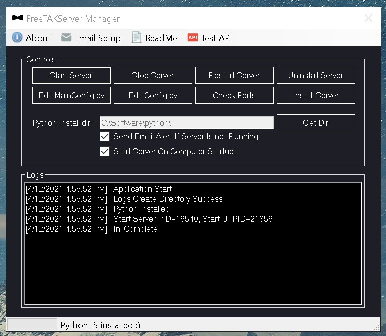
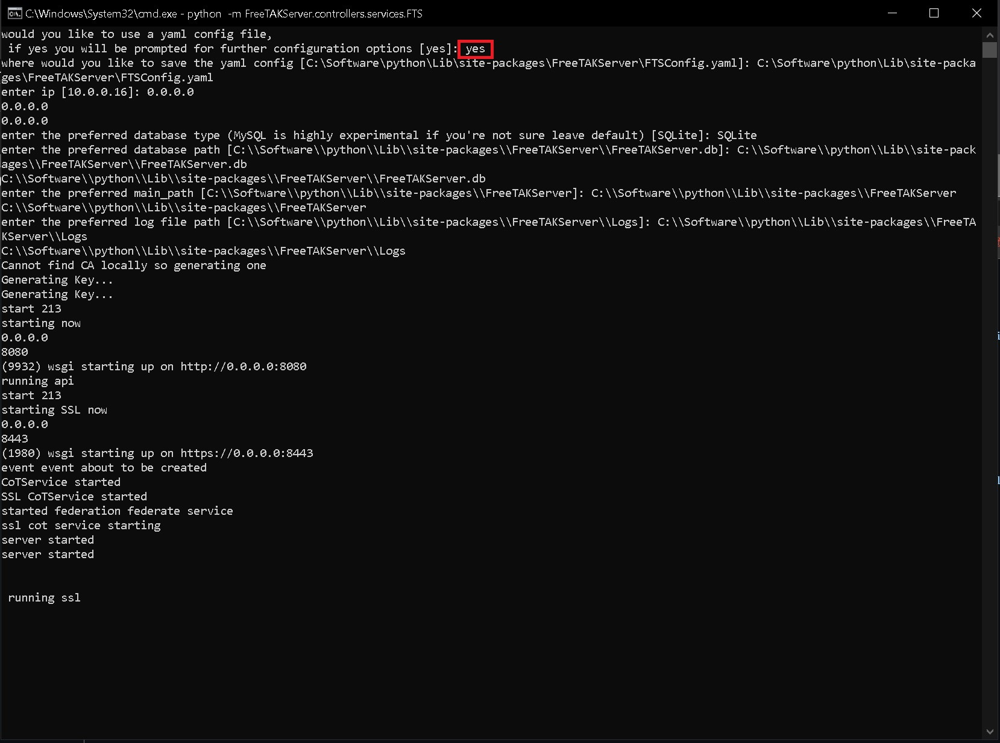
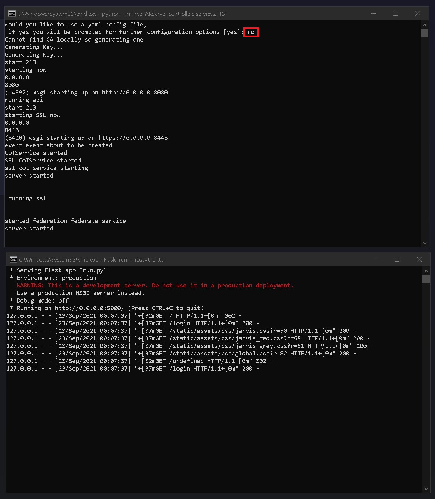

# FreeTAKServer Manager For Windows Computers

**FreeTAKServer Manager** an application for the `Windows OS` which allows the *installation*, *start*, *stop* and *uninstallation* of the FreeTAKServer all in a dedicated GUI.

More features (*such as: FTS API testing, easy config file access and Telegram BOT API testing etc.*) will be added to improve the FTS windows experience.

C# WinForms & WPF versions are supported.

---

The FreeTAKServer Manager C# application was created to make using the current `v1.x.x` of FreeTAKServer more user friendly.

FreeTAKServer Manager has the ability to Start, Stop, Restart, Install and Uninstall the FreeTAKServer & FreeTAKServer-UI.

It can also start on startup, send alert emails, let the user test the API (localhost & custom), allow quick `MainConfig.py` & `config.py` edits, Open a portforward testing page.

The App requires Admin privilege in order to run cmd commands effectively.

Remove all previous Python environment variables (if you have them) because they mess up the paths.

N.B the application has been created with the microsoft Visual Studio 2019 Community IDE. (https://visualstudio.microsoft.com/vs/)

https://dotnet.microsoft.com/download/visual-studio-sdks

If you would like to use the `.yaml` file please type `yes` in the cmd console.

Default username and password: u=`admin` p=`password`.

Note: You will have to setup additional parameters as shown in the image below.

* Examples
    * The yaml config path: `C:\YOUR_PATH\python\Lib\site-packages\FreeTAKServer\FTSConfig.yaml`
    * IP: `0.0.0.0`
    * Database type: `SQLite`
    * Database path: `C:\YOUR_PATH\python\Lib\site-packages\FreeTAKServer\FreeTAKServer.db`
    * Preferred main_path: `C:\YOUR_PATH\python\Lib\site-packages\FreeTAKServer\FreeTAKServer.db`
    * Preferred log file path: `C:\YOUR_PATH\python\Lib\site-packages\FreeTAKServer\Logs`

If you do not want to use the `.yaml` file type `no` in the cmd console.

# App specific README

* [WinForms application](https://github.com/Cale-Torino/FreeTAKServer_Manager/tree/main/WinForms "WinForms application")
* [WPF application](https://github.com/Cale-Torino/FreeTAKServer_Manager/tree/main/WPF "WPF application")

# TODO

- Reduce code.
- Improve methods
- Move functions to .dll files to clean up exe code.

> FreeTAKTeam https://github.com/FreeTAKTeam

> Checkout my tutorials https://tutorials.techrad.co.za/2021/04/13/freetakserver-manager

> Video demonstration https://youtu.be/0A0-ee2L3Y4

> Source code https://github.com/Cale-Torino/FreeTAKServer_Manager

