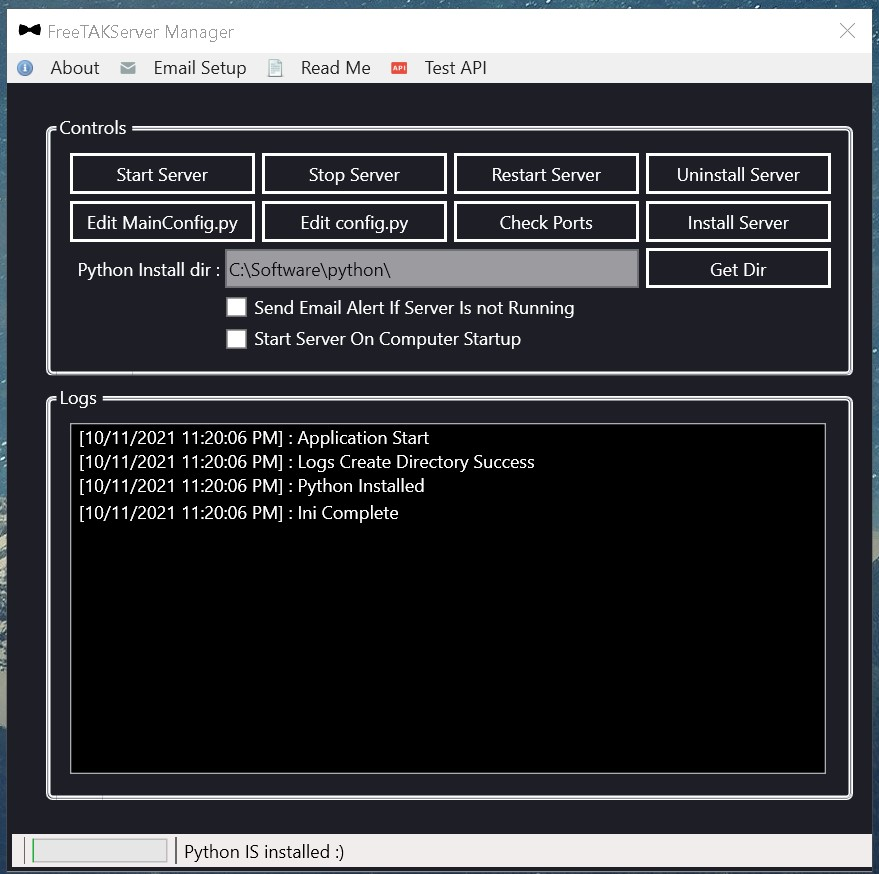
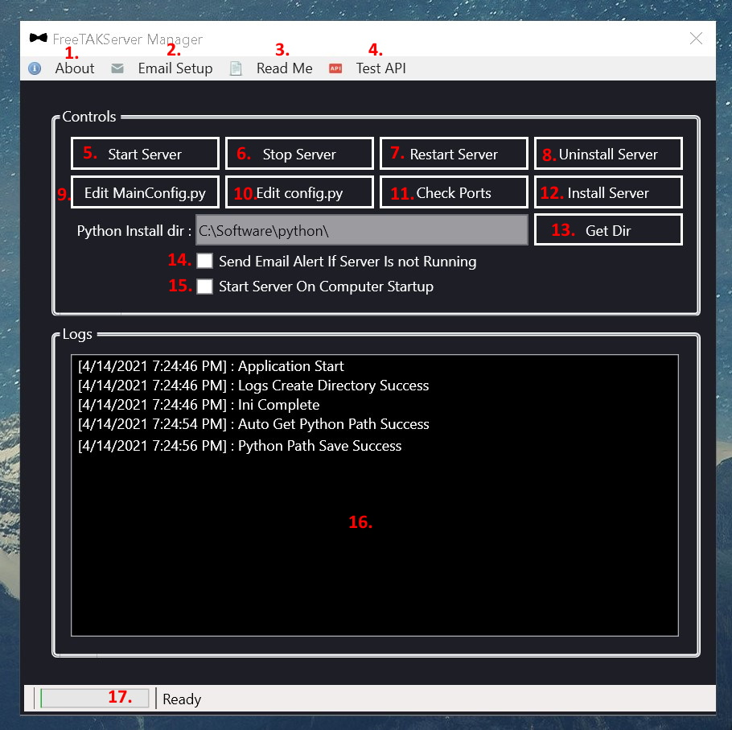
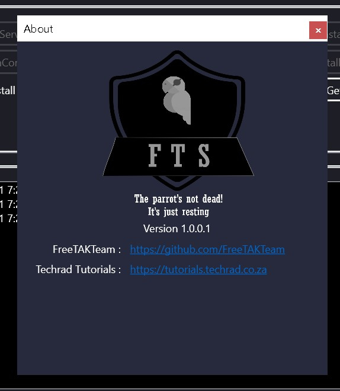
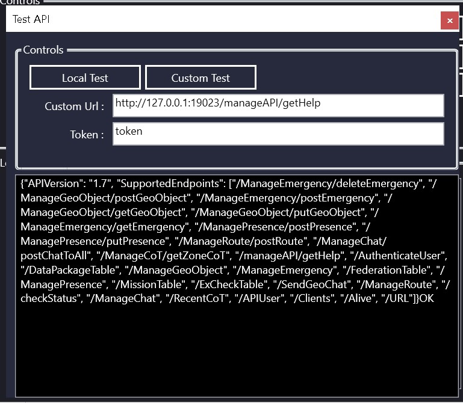

# FreeTAKServer Manager For Windows Computers

**FreeTAKServer Manager** an application for the `Windows OS` which allows the *installation*, *start*, *stop* and *uninstallation* of the FreeTAKServer all in a dedicated GUI.

More features (*such as: FTS API testing, easy config file access and Telegram BOT API testing etc.*) are constantly being added to improve the FTS windows experience.

C# WinForms & WPF versions are supported.

---

The FreeTAKServer Manager C# application was created to make using the current `v1.7` of FreeTAKServer more user friendly.

FreeTAKServer Manager has the ability to Start, Stop, Restart, Install and Uninstall the FreeTAKServer & FreeTAKServer-UI.

It can also start on startup, send alert emails, let the user test the API (localhost & custom), allow quick `MainConfig.py` & `config.py` edits, Open a portforward testing page.

The App requires Admin privilege in order to run cmd commands effectively.

Remove all previous Python environment variables (if you have them) because they mess up the paths.

N.B the application has been created with the microsoft Visual Studio 2019 Community IDE. (https://visualstudio.microsoft.com/vs/)

[](img/heading.jpg)

# WPF Section

## App File Structure

```
FreeTAKServer_Manager WPF root folder
│   FreeTAKServer_Manager_WPF.exe
│   config.py
│   MainConfig.py
│   ReadMe.txt
│   requirements.txt
│
└───Logs
    │   FreeTAKServer_Manager_WPF_2021-14-4--20-32-10.log
```

## App Behaviour


The app is built on the `.NET Framework 4.7.2` & is a `WPF` (Windows Presentation Foundation) C# application.

The app must run with admin privileges for the cmd commands to work correctly.

supported OS's are Windows vista - Windows 10.

Windows native classes
- The app makes use of the windows `Registry` to check for the python path and to allow start on startup.

- The app will use the `Process` class to send commands to the commandline.

- The app will use the `MailMessage` class to send emails to the details specified.

- The `File` class will be used for read/write functions.

- The `HttpClient` class will be used for testing the API.

Custom classes
- `CMD_Class.cs` handles all the calls to `cmd.exe`.

- `CMD_PID_Class.cs` gets or sets the Server and ServerUI PID in public variables.

- `EmailVarClass.cs` gets or sets the public Email variables.

- `LoggerClass.cs` logs events such as errors or results to a file.

- `EncryptionClass.cs` to encrypt the password for the email function.

## Screenshots

### MainForm

Breif MainForm controls explained.

[](img/mainform.jpg)

1. *About* form, showing more information and credits.
2. *Email Setup* form, allows the user to set their email details.
3. *ReadMe* form, shows the release history of the app.
4. *Test API* form, lets the user test the APIs used in the FreeTAKServer.
5. *Start Server* button, starts the server/UI & opens `http://127.0.0.1:5000` in the default web browser.
6. *Stop Server* button, stops the server and UI.
7. *Restart Server* button, restarts the server.
8. *Uninstall Server* button, uninstalles the server & UI also deletes the `FTSDataBase.db` file.
9. *Edit MainConfig.py* button, allows the user to quickely open the `MainConfig.py` file with the default text editor.
10. *Edit Config.py* button, allows the user to quickely open the `Config.py` file with the default text editor.
11. *Check Ports* button, opens a portforward checking website `https://www.yougetsignal.com/tools/open-ports/`.
12. *Install Server* button, install the server/UI and edits the config files to use windows paths.
13. *Get Dir* button, try to automatically get the Python directory if it fails the app will ask for manual input.
14. *Send Email Alert If Server Is Not Running* checkbox, if pinging the server fails an email will be sent.
15. *Start Server On Computer Startup* checkbox, start the server and UI on startup.
16. *Logs* richtextbox, displays events and errors.
17.  *Status* statusStrip, shows the progress of any event.

### About

credits, links to github and my tutorial site.

[](img/about.jpg)

### Test API

Test API page fill in your token and test the API locally or send a custom request.

[](img/testapi.jpg)

# TODO

- Reduce code.
- Improve methods
- Move functions to .dll files to clean up exe code.

> FreeTAKTeam https://github.com/FreeTAKTeam

> Checkout my tutorials https://tutorials.techrad.co.za/2021/04/13/freetakserver-manager

> Video demonstration https://youtu.be/0A0-ee2L3Y4

> Source code https://github.com/Cale-Torino/FreeTAKServer_Manager

